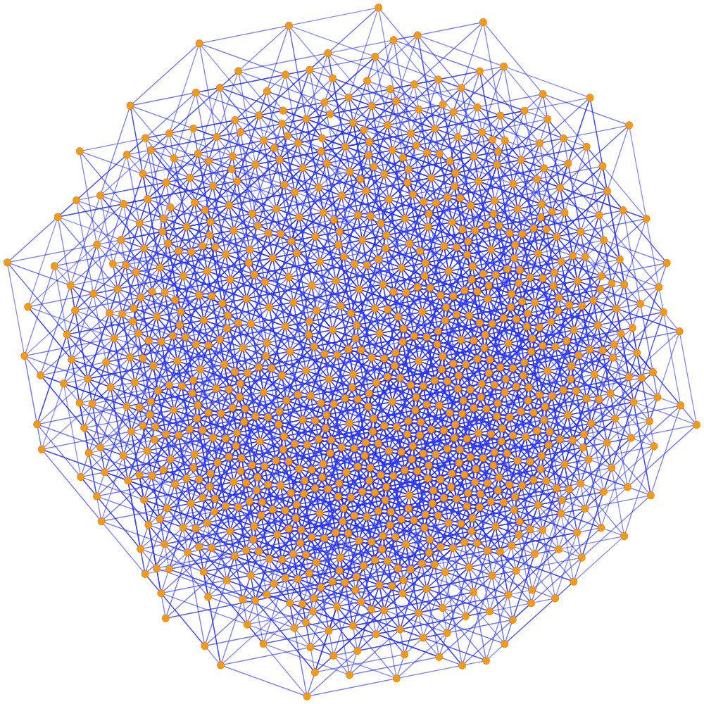
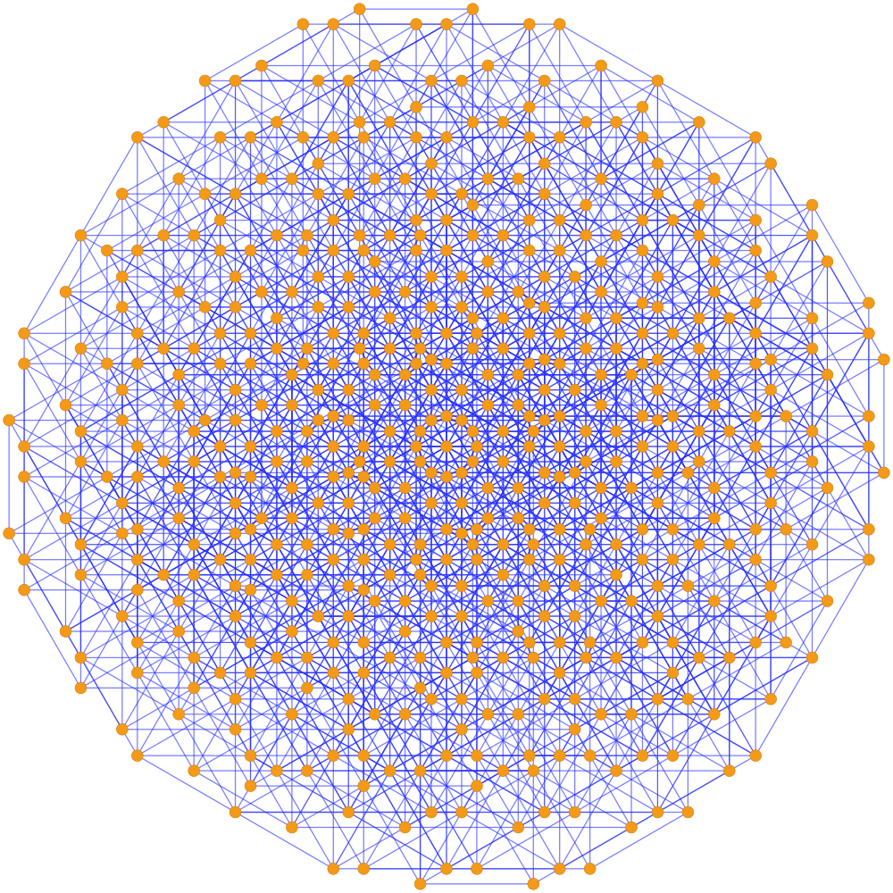
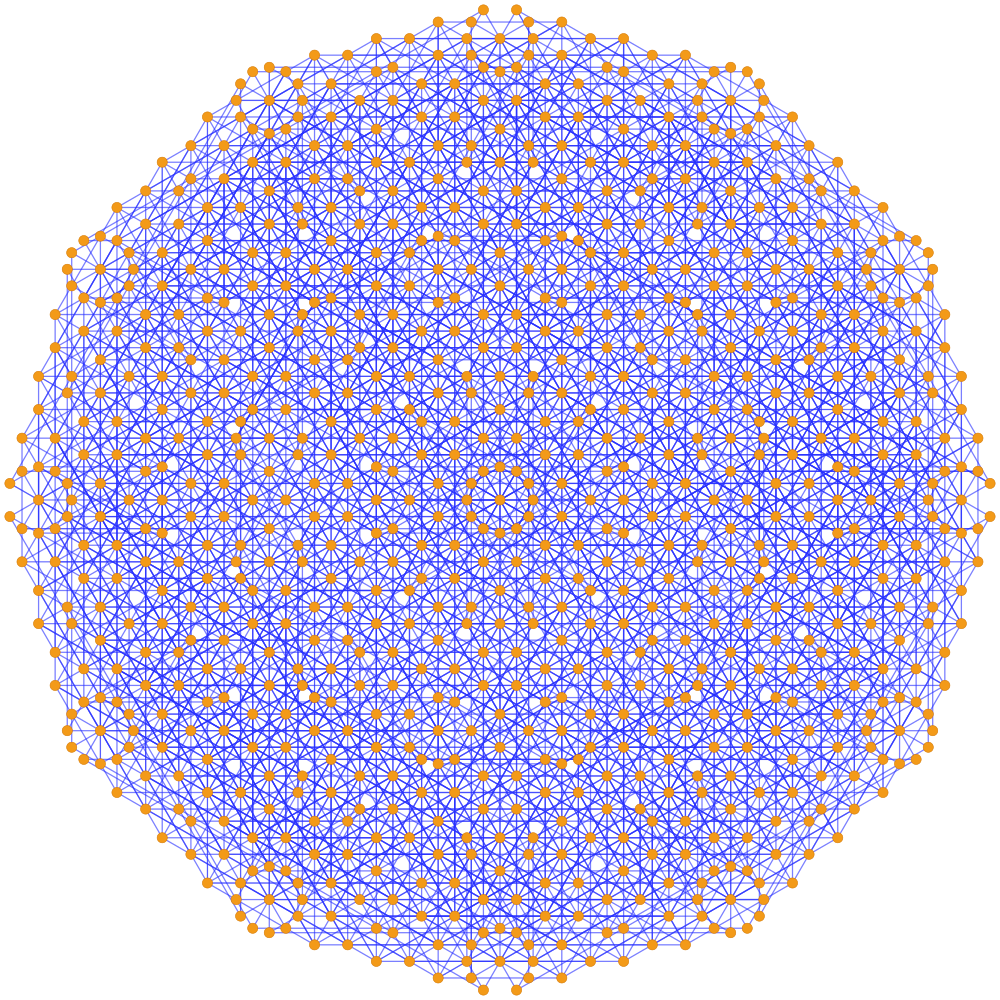
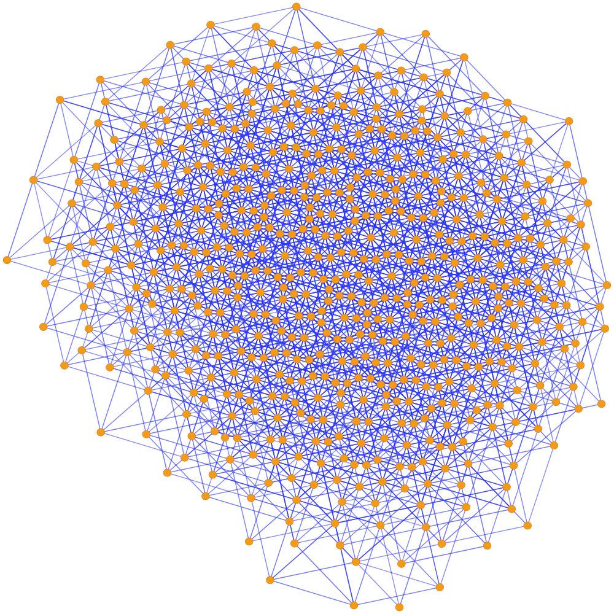
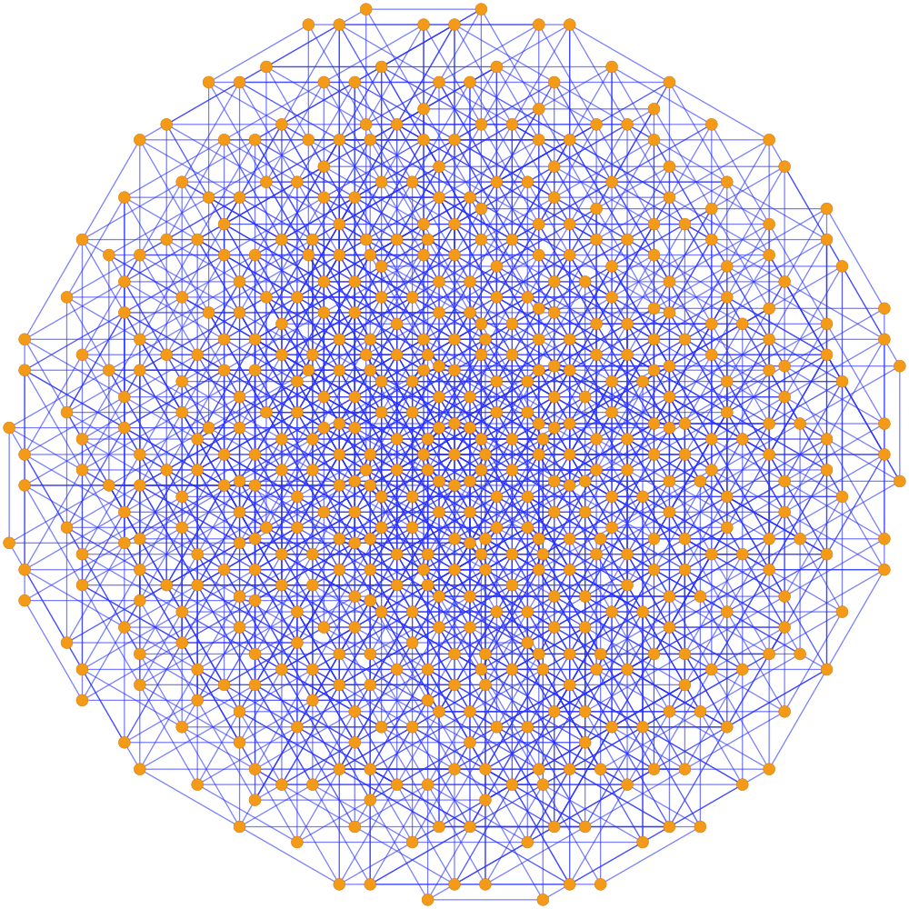
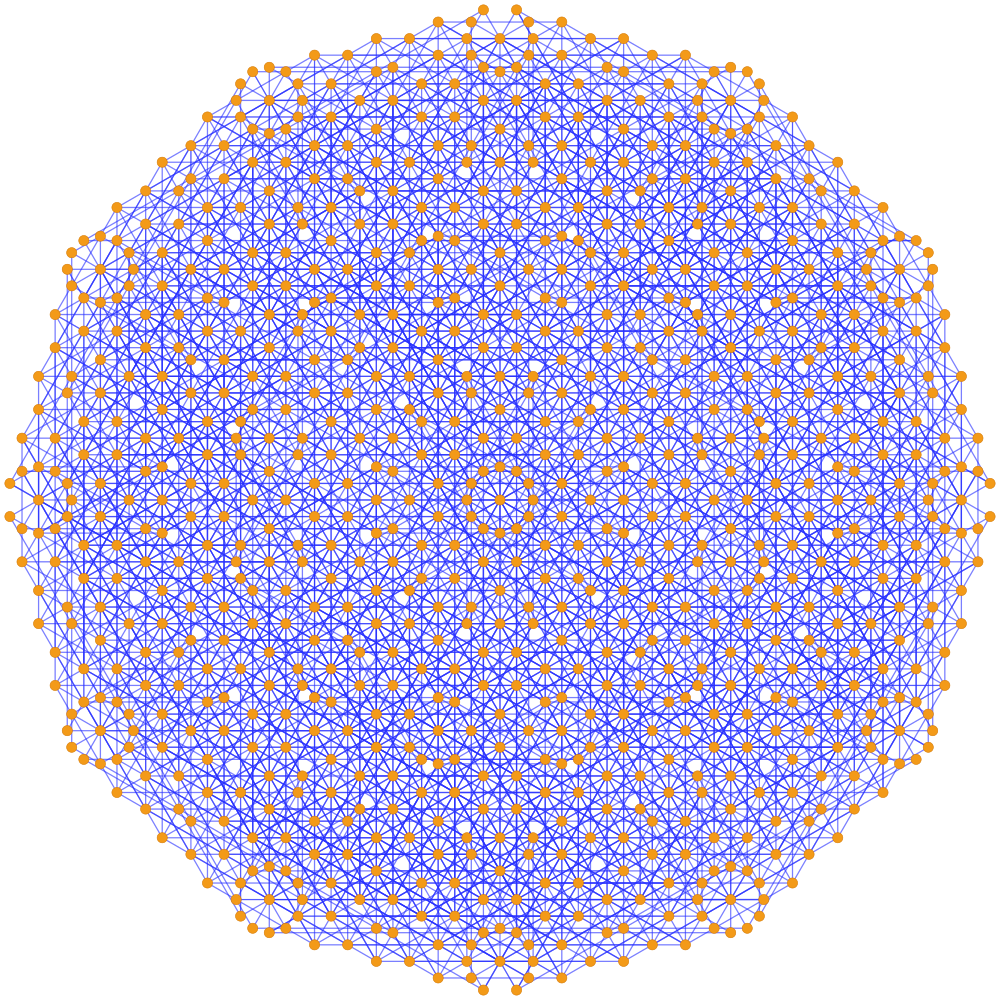
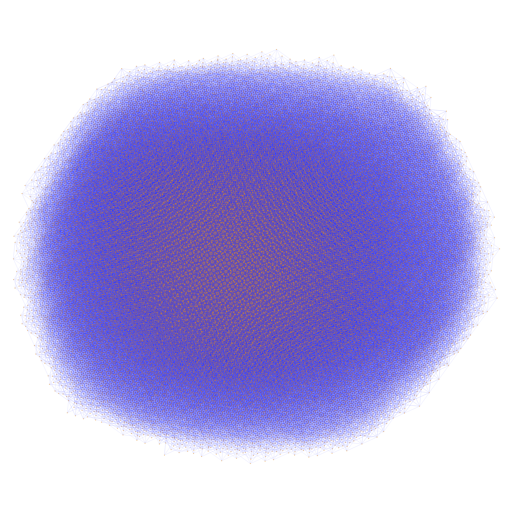

# Graphglyph

Encode text as reversible blue-and-orange unit-distance graph images.

The visual style is based on the finite illustration from OpenAI's unit-distance
paper: points of the form

```text
z = a + b i + c rho + d i rho
rho = exp(2 pi i / 3)
```

with edges drawn between projected points at Euclidean distance `1`. See
[Planar Point Sets with Many Unit Distances](https://cdn.openai.com/pdf/74c24085-19b0-4534-9c90-465b8e29ad73/unit-distance-proof.pdf).

## How It Works

- Text is normalized with Unicode NFKC and encoded as UTF-8.
- Long payloads are zlib-compressed.
- A packet header stores magic bytes, version, flags, seed, length, and CRC32.
- Payload nibbles are distributed through seeded graph cells.
- Each cell encodes four bits by making one edge in each candidate edge pair
  stronger than the other.
- The same text seed also varies the coefficient window, point count, basis
  family, edge weights, and payload placement.

The SVG and JSON outputs are decodable. PNG outputs are presentation previews.

## Usage

```bash
python3 graph_cipher.py encode "you are loved immensely" \
  -o examples/you_are_loved_immensely.svg \
  --json examples/you_are_loved_immensely.json

python3 graph_cipher.py decode examples/you_are_loved_immensely.svg
```

Colors are presentation-only and do not affect decoding:

```bash
python3 graph_cipher.py encode "goblins" -o goblins_dark.svg \
  --edge-color "#7c8cff" \
  --node-color "#ffd166" \
  --node-stroke-color "#d08700" \
  --background-color "#0b1020"
```

The default `--mode glyph --variant-strength 0.75` gives visible variation
between texts. Encoding has three public generation modes; decoding is the same
for every mode because the recoverable data is stored in weighted graph edges.

Generation modes:

| Mode | Point set | Typical use |
| --- | --- | --- |
| `glyph` | Seeded text-varying coefficient window. | Default visual glyphs with stronger phrase-to-phrase variation. |
| `norm` | `a,b,c,d in {-N,...,N}` and `|a + bi + c rho + d i rho| < R`. | Matches the first bounded-norm graph variant. |
| `double-norm` | `|a + bi + c rho + d i rho| < R` and `|a - bi + c rho - d i rho| < R2`. | Matches the later two-embedding graph variant. |

```bash
# 1. Text-varying glyph mode.
python3 graph_cipher.py encode "text" -o glyph.svg --mode glyph

# 2. Single bounded complex norm:
# a,b,c,d in {-N,...,N}, z = a + bi + c rho + d i rho, |z| < R.
python3 graph_cipher.py encode "text" -o norm.svg \
  --mode norm --unit-range 2 --norm-radius 4

# 3. Two-embedding norm mode:
# |a + bi + c rho + d i rho| < R and |a - bi + c rho - d i rho| < R2.
# R2 defaults to R; set --dual-norm-radius for asymmetric bounds.
python3 graph_cipher.py encode "text" -o double_norm.svg \
  --mode double-norm --unit-range 4 --norm-radius 4
```

Legacy `--window` names are still accepted as aliases, but `--mode` is the
stable interface.

## Examples

### You Are Loved Immensely

#### Glyph

[SVG](examples/you_are_loved_immensely.svg) |
[PNG](examples/you_are_loved_immensely.png)



#### Norm

[SVG](examples/you_are_loved_immensely_norm.svg) |
[PNG](examples/you_are_loved_immensely_norm.png)



#### Double Norm

[SVG](examples/you_are_loved_immensely_double_norm.svg) |
[PNG](examples/you_are_loved_immensely_double_norm.png)



### Goblins

#### Glyph

[SVG](examples/goblins.svg) |
[PNG](examples/goblins.png)



#### Norm

[SVG](examples/goblins_norm.svg) |
[PNG](examples/goblins_norm.png)



#### Double Norm

[SVG](examples/goblins_double_norm.svg) |
[PNG](examples/goblins_double_norm.png)



### Meditations On Moloch

Encoded from Scott Alexander's
[Meditations On Moloch](https://slatestarcodex.com/2014/07/30/meditations-on-moloch/).

[PNG](examples/meditations_on_moloch.png)



The large `meditations_on_moloch.svg` is intentionally not included.

All code written by GPT 5.5.
